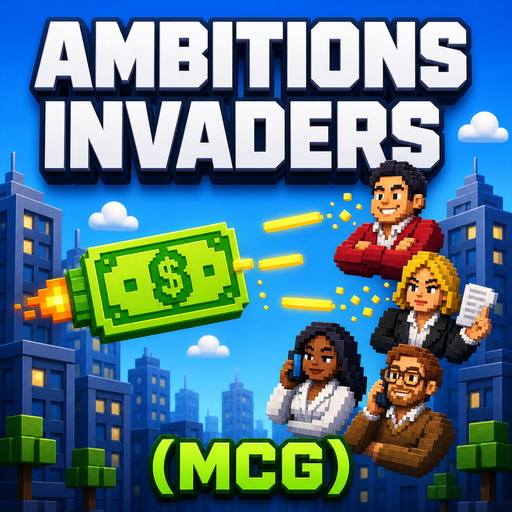

# [MCG] Ambitions Invaders — 1.0.0

Your cash. Their faces. No negotiations.

The cover is promotional artwork, matching the Flappy Ambitions and Snacke series. Actual gameplay screenshots appear below.

A horizontal arcade shooter for the computers in **Big Ambitions**, powered by [More Computer Games (MCG)](https://github.com/capisoft-lib/BigAmbitions_LIB_BA_MoreComputerGames). Fly the banknote from Flappy Ambitions, fire yellow lasers, and take on pixel-art versions of Huang Guo, Ingrid Schneider, Jessica Johnson and Thierry Laurent Moreau.

## Play

On an in-game computer, choose **Play video games**, then **Ambitions Invaders** in MCG.

| Action | Controls |
| --- | --- |
| Move in two dimensions | Arrow keys, WASD or ZQSD |
| Fire to the right | Hold Space or the left mouse button |
| Start | Space, left click or Enter |
| Retry | Space, left click, Enter or R |
| Leave the computer | Tab, handled by MCG |
| Return to the game selection | Backspace, handled by MCG |
| Pause Big Ambitions | Escape, handled by the base game |

Protect your three shield points through progressively harder waves. Collisions, enemy shots and rivals escaping past the left edge cost one point, followed by brief invulnerability. Enemy fire starts at wave two; a boss arrives every four waves. The round ends when your shield is exhausted.

MCG stores local records separately for this game and ruleset. Only completed rounds count; leaving a round does not submit its score. The mod does not access the network or write directly to Big Ambitions saves. Version **1.0.0** has no soundtrack.

## Screenshots

These English screenshots are actual renders from an isolated Unity 2022.3.62f2 player running the game sources. They demonstrate the game UI and gameplay states; they are not screenshots of a native Big Ambitions session.

## Install and dependencies

This repository publishes source code and artwork, not game or dependency binaries. Build it using [the build guide](docs/BUILD.md). Copy only the resulting **MCG_AmbitionsInvaders** folder into the game's `ModsLocal` directory while Big Ambitions is closed.

For an upgrade from the old `AmbitionsInvaders` folder, move the old folder out of `ModsLocal` first. Keep only one installed copy. The assembly name, mod ID, catalog ID and ruleset are unchanged, so the folder rename does not reset records.

Install **LIB BA More Computer Games 1.0.0+** separately. It is the only required mod library, and its DLL is not bundled. Flappy Ambitions is not required. See [required mods](REQUIRED_MODS.md).

## Languages

The interface follows Big Ambitions and supports all **22 game languages**: English, French, German, Simplified Chinese, Traditional Chinese, Czech, Danish, Dutch, Finnish, Greek, Hungarian, Italian, Japanese, Korean, Lithuanian, Polish, Brazilian Portuguese, Romanian, Russian, Spanish, Turkish and Ukrainian. The game title, rival names and key letters are shared across languages.

## Development and rights

The 1.0.0 release includes a dedicated icon, aligned mod/assembly versions and English/French publication copy. Gameplay, the 22 translations and record identifiers are preserved. See the [changelog](CHANGELOG.md) and [release files](https://github.com/capisoft-lib/BigAmbitions_MCG_AmbitionsInvaders/tree/main/releases/1.0.0). Source publication does not publish a Steam Workshop item.

See [build and test instructions](docs/BUILD.md), [verification scope](VERIFICATION.md), and [publication privacy](docs/PRIVACY.md).

Original code is MIT licensed. Rival portraits are AI-assisted pixel-art derivatives of Big Ambitions artwork, with [source attribution and generation prompts](ART_PROVENANCE.md). The original characters, artwork, derived portraits, promotional cover and screenshots are excluded from the code license; their respective rights remain with their holders. Unity and Big Ambitions assemblies are not redistributed. This is an unofficial community mod.

## Support Ambitions Invaders

**[Buy me a coffee](https://buymeacoffee.com/capitaine)** to support future updates.
